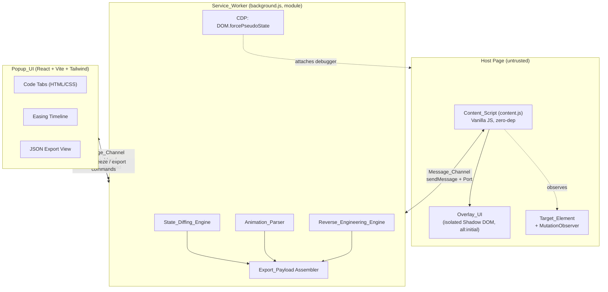
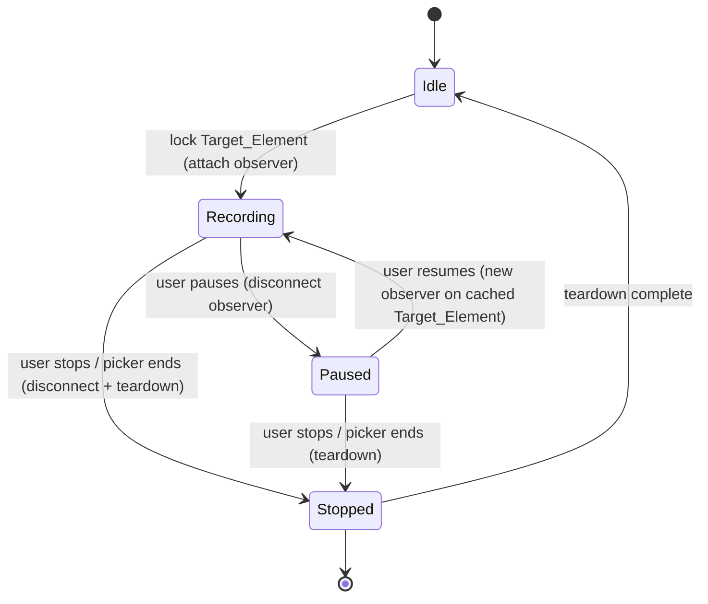
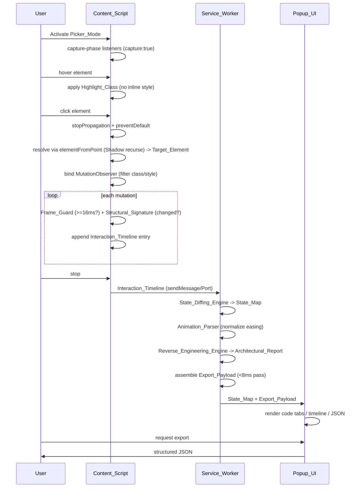

# Design Document

## Overview

UI Motion Grabber is a Manifest V3 Chromium extension that reverse-engineers live micro-interactions. It is 100% local, open-source, and zero-dependency in its injected layers. The system observes a user-selected element over time, diffs its state transitions, parses computed styles and active animations, classifies how the component was built, and exports a structured JSON payload containing HTML/CSS code tabs, Figma design tokens, and a markdown architectural report.

The design is organized around three cooperating runtime contexts, matching the MV3 isolation model:

1. **Content_Script (`content.js`)** — pure Vanilla JS injected into the host page. Owns element picking, hover highlighting, Shadow DOM traversal, the Mutation_Engine, the Interaction_Timeline, the isolated Overlay_UI, and full teardown.
2. **Service_Worker (`background.js`, `type: module`)** — async MV3 background. Owns the State_Diffing_Engine, Animation_Parser, CDP coordination, the Reverse_Engineering_Engine, and Export_Payload assembly.
3. **Popup_UI** — React + Vite + Tailwind CSS. Renders code tabs, the easing timeline, and the JSON export.

The central design tension is **isolation under hostility**: the Content_Script runs inside an arbitrary, possibly adversarial page, so it must observe without mutating, inject without polluting, and tear down without leaking. The Service_Worker is the only context permitted to run heavy transformation, and it must finish a pass within an 8ms budget. The Popup_UI is a pure consumer of the State_Map and Export_Payload.

### Design Goals

- **Zero side effects on the host page.** Highlighting and observation never touch inline styles; the Overlay_UI lives in an isolated Shadow DOM.
- **Bounded work.** The Frame_Guard debounce and Structural_Signature dedup prevent runaway recomputation; the Service_Worker pass is sub-8ms.
- **Deterministic data model.** The Export_Payload is plain JSON with a stable shape so that serialize → parse is an identity round-trip.
- **Local-only.** No network egress, no backend, permissions limited to `activeTab`, `scripting`, `debugger`.

### Key Design Decisions

| Decision | Rationale |
|---|---|
| Split capture (Content_Script) from analysis (Service_Worker) | Keeps injected code zero-dependency and cheap; isolates heavy transform work in the worker where it can be budgeted and where CDP is reachable. |
| Highlight via a CSS class, never inline style | Requirement 1.3 / steering: observing inline `style.cssText` is part of the Structural_Signature, so writing inline styles would corrupt our own capture. |
| MutationObserver bound only to Target_Element with `attributeFilter` | Requirement 2.2/2.3 / steering guard matrix: avoids analytics/text noise and global churn that would freeze the tab. |
| Frame_Guard (16ms) + Structural_Signature dedup | Two independent gates — temporal (too soon) and structural (no real change) — protect against infinite render loops. |
| Overlay_UI in Shadow DOM with `all: initial` | Requirement 8: guarantees visual isolation in both directions, even against host `!important` rules. |
| Easing normalization via a fixed conversion map | Requirement 4.3: deterministic, table-driven, and trivially testable as a pure function. |
| Export_Payload is plain serializable JSON | Requirement 6.4: enables a clean round-trip property and decouples the Popup_UI from internal objects. |

## Architecture

### Runtime Context Topology



### Recording_Session Lifecycle

A Recording_Session is the unit of capture for one Target_Element. Its Recording_Status follows a strict state machine. The **Session_Controller** (a Content_Script subsystem) is the single owner of Recording_Status and of all MutationObserver attachment/disconnection that accompanies these transitions (Requirement 11).



- **Idle**: no Target_Element locked; Picker_Mode may or may not be active. No observer attached.
- **Recording**: MutationObserver attached to Target_Element; timeline entries are being appended (subject to Frame_Guard and Structural_Signature gates) (Req 11.2).
- **Paused**: the Session_Controller **disconnects the MutationObserver immediately** so the paused session imposes zero observation/processor overhead on the host page (Req 11.3). Because the observer is disconnected, no mutations are processed and no entries are appended to the Interaction_Timeline while Paused (Req 11.5). The cached Target_Element reference is retained so the session can resume on the same element.
- **Stopped**: observer disconnected, listeners released; the timeline is frozen and forwarded for diffing (Req 11.6).

**Pause/resume semantics (Requirement 11):** Pausing is not a passive "ignore" — it is an active disconnection. When Recording_Status transitions to Paused, the Session_Controller calls `MutationObserver.disconnect()` to eliminate page processor overhead (Req 11.3). When Recording_Status transitions from Paused back to Recording, the Session_Controller **creates a new MutationObserver instance** bound to the cached Target_Element (Req 11.4) rather than re-using a retained, still-attached observer. This guarantees a paused session is truly inert.

State transitions out of Recording/Paused into Stopped always trigger teardown (Requirement 10.3, 10.4, 11.6).

### End-to-End Data Flow



### Module Boundaries

- **Capture layer (Content_Script)** never imports framework code and is shipped unbundled. It only emits raw data (timeline entries, computed-style snapshots, frame errors) over the Message_Channel.
- **Analysis layer (Service_Worker)** is the sole owner of transformation and the sole holder of the `debugger` attachment for CDP. It is a module-type worker so the analysis engines can be split into ES modules while remaining MV3-compliant.
- **Presentation layer (Popup_UI)** is read-mostly: it renders the State_Map / Export_Payload and issues commands (start, pause, stop, freeze pseudo-state, export). It performs no diffing.

## Components and Interfaces

### Content_Script Components

#### Picker
Manages Picker_Mode. Registers `mouseover`, `mouseout`, and `click` listeners with `{ capture: true }`. Tracks attached listeners in a registry for guaranteed teardown.

```
Picker.activate(): void          // register capture-phase listeners
Picker.deactivate(): void        // remove every attached listener (Req 1.8)
Picker.onHover(el): void         // apply Highlight_Class to el, remove from previous
Picker.onClick(event): void      // stopPropagation + preventDefault, lock Target_Element
Picker.resolveElement(x, y): Element   // elementFromPoint with recursive Shadow_Root descent (Req 1.7)
```

`resolveElement` repeatedly calls `elementFromPoint` on the deepest open `shadowRoot` encountered, descending until no further shadow root contains the point, returning the innermost element.

#### Highlighter
Applies and removes `Highlight_Class` (`.ui-motion-grabber-target-hover`) via `classList`. Never reads or writes the element's inline `style` attribute (Req 1.3). The highlight visual is delivered through a stylesheet injected into the Overlay_UI's Shadow DOM scope and a host-page class hook, so the host's own `style` attribute is untouched.

#### Mutation_Engine
Owns the MutationObserver lifecycle and the two dedup gates.

```
Mutation_Engine.attach(target): void     // create a NEW observer, observe(target, { attributes:true, attributeFilter:["class","style"] })
Mutation_Engine.handle(records): void     // apply Frame_Guard, then Structural_Signature, then append
Mutation_Engine.detach(): void            // disconnect observer (Req 10.3, 11.3, 11.6)
```

Each `attach(target)` constructs a fresh `MutationObserver`; `detach()` calls `disconnect()` and drops the observer reference. The Session_Controller drives these calls across the lifecycle: `attach` on Idle→Recording (Req 11.1, 11.2), `detach` on Recording→Paused (Req 11.3), a fresh `attach` on the cached Target_Element on Paused→Recording (Req 11.4), and `detach` on any transition into Stopped (Req 11.6). The engine never holds a connected-but-idle observer while Paused.

Gate order on each mutation batch:
1. **Frame_Guard**: `now = performance.now()`; if `now - lastProcessed < 16`, drop (Req 2.4).
2. **Structural_Signature**: `sig = target.className + target.style.cssText`; if `sig === cachedSig`, drop (Req 2.5).
3. **Append**: update `cachedSig = sig`, `lastProcessed = now`, push a timestamped entry onto the Interaction_Timeline (Req 2.6, 2.7).

#### Overlay_UI Host
Creates a container element, attaches an open `shadowRoot`, and injects a stylesheet whose `:host`/root rule begins with `all: initial` (Req 8.1, 8.2). All overlay rendering happens inside this root, isolating it from host `!important` rules (Req 8.3). Interpolated layer shifts are scheduled with `requestAnimationFrame` to hold 60fps (Req 10.2).

#### Session_Controller
Implements the Recording_Session/Recording_Status state machine and is the single owner of Recording_Status transitions (Requirement 11). It also acts as the Message_Channel client. It coordinates MutationObserver lifecycle through the Mutation_Engine across transitions:

```
Session_Controller.lock(target): void     // Idle -> Recording: Mutation_Engine.attach(target) (Req 11.1, 11.2)
Session_Controller.pause(): void           // Recording -> Paused: Mutation_Engine.detach() (Req 11.3)
Session_Controller.resume(): void          // Paused -> Recording: Mutation_Engine.attach(cachedTarget) — NEW observer (Req 11.4)
Session_Controller.stop(): void            // -> Stopped: detach + Picker.deactivate + release refs, forward timeline (Req 11.6)
```

- On **pause**, it disconnects the observer immediately so a paused session imposes no host-page overhead (Req 11.3); while Paused no entries are appended because no observer is connected (Req 11.5).
- On **resume**, it constructs a brand-new `MutationObserver` bound to the cached Target_Element (Req 11.4); it does not re-enable a retained observer.
- On **stop** (or picker-end), it invokes `Mutation_Engine.detach()`, `Picker.deactivate()`, releases all observer/listener references (Req 10.3, 10.4, 11.6), then sends the frozen Interaction_Timeline to the Service_Worker.

The Session_Controller exposes the canonical Recording_Status to the Message_Channel; the Popup_UI derives its Session_Controls_State view-model one-to-one from this status (it is not a separate source of truth — see Data Models and Req 11.7).

### Service_Worker Components

#### State_Diffing_Engine
Consumes an Interaction_Timeline and computes per-transition metrics.

```
diff(timeline): State_Map
  - delayOffset / durationOffset between consecutive entries (Req 3.1)
  - easing curve per transition (Req 3.2)
  - transform matrix when a transform is present (Req 3.3)
```

#### Animation_Parser
```
parseComputed(target): ComputedStyleSnapshot   // window.getComputedStyle (Req 4.1)
parseAnimations(target): AnimationDescriptor[]  // target.getAnimations() (Req 4.2)
normalizeEasing(value): CubicBezier             // map keyword -> cubic-bezier (Req 4.3)
```

The easing conversion map is fixed:

| Keyword | cubic-bezier |
|---|---|
| `linear` | `cubic-bezier(0, 0, 1, 1)` |
| `ease` | `cubic-bezier(0.25, 0.1, 0.25, 1)` |
| `ease-in` | `cubic-bezier(0.42, 0, 1, 1)` |
| `ease-out` | `cubic-bezier(0, 0, 0.58, 1)` |
| `ease-in-out` | `cubic-bezier(0.42, 0, 0.58, 1)` |

#### CDP Coordinator
On a freeze request, attaches the debugger to the active tab and issues `DOM.forcePseudoState` to freeze the Target_Element in `:hover` or `:active` (Req 4.4). While frozen, the Animation_Parser extracts metrics even when the pointer is not over the element (Req 4.5).

#### Reverse_Engineering_Engine
```
classifyLayout(computed): "Flexbox" | "Grid" | "Other"     // from display (Req 5.1)
classifyDelivery(animations): "WAAPI" | "CSS transitions"  // (Req 5.2)
classifyProperty(prop): "composite-friendly" | "layout-triggering" | "other"
                        // transform/opacity vs top/width/margin (Req 5.3, 5.4)
generateReport(...): string  // markdown Architectural_Report (Req 5.5)
```

#### Export_Payload Assembler
Combines code tabs, Figma tokens, and the report into the Export_Payload (Req 6.1, 6.2). Figma timing tokens are emitted in `cubic-bezier(x1,y1,x2,y2)` string form. The entire assembly pass is budgeted under 8ms (Req 10.1).

### Popup_UI Components

- **Feedback_Banner** — rendered at the top of the Popup_UI (Req 12.1). Displays the current `User_Feedback_Message` driven by status updates and exceptions: live Recording_Session status updates (Req 12.2), CDP `debugger` attach / `DOM.forcePseudoState` failures as `ERROR` (Req 12.4), restricted/system pages as `WARN` (Req 12.5), excluded cross-origin sub-frames as `WARN` (Req 12.6), and clipboard-copy failures as `ERROR` (Req 6.9). Each message carries a `type` of `SUCCESS | ERROR | WARN` and a `text` string (Req 12.3).
- **CodeTabs** — toggles between HTML and CSS views (Req 6.5). Each tab exposes an asynchronous **Copy to Clipboard** action that writes the displayed code via `navigator.clipboard.writeText()` (Req 6.6). On success it shows inline visual success feedback (e.g., a "Copied" tooltip/check) for that action (Req 6.7); on failure it routes a `User_Feedback_Message` of type `ERROR` to the Feedback_Banner (Req 6.9). Because the write is a popup user-gesture clipboard write, it requires no manifest permission beyond the existing `activeTab` / `scripting` / `debugger` set (Req 6.8, 7.7).
- **EasingTimeline** — visualizes the State_Map transitions and easing curves.
- **JsonExportView** — renders the Export_Payload as formatted JSON on export request (Req 6.3).
- **FrameNotice** — surfaces cross-origin sub-frame exclusion reports (Req 9.2); excluded frames are also surfaced as `WARN` messages in the Feedback_Banner (Req 12.6).

### Messaging Interface (Message_Channel)

All cross-context traffic uses `chrome.runtime.sendMessage` for one-shot commands and Chrome `Port` connections for streaming the timeline/state (Req 7.6). Message envelope:

```
{ type: string, sessionId: string, payload: object }
```

Representative message types: `PICKER_START`, `TARGET_LOCKED`, `TIMELINE_CHUNK`, `STATE_MAP`, `EXPORT_PAYLOAD`, `FREEZE_PSEUDO`, `FRAME_EXCLUDED`, `SESSION_STOP`.

### Iframe Injection

Sub-frame injection uses `chrome.scripting.executeScript` with `allFrames: true` (Req 9.1). Cross-origin, inaccessible frames are caught, excluded from selection, and reported to the Popup_UI via a `FRAME_EXCLUDED` message (Req 9.2).

## Data Models

### Interaction_Timeline Entry

```typescript
interface TimelineEntry {
  timestamp: number;        // performance.now() at processing time
  className: string;        // Target_Element.className snapshot
  cssText: string;          // Target_Element.style.cssText snapshot
  structuralSignature: string;  // className + cssText (the dedup key)
}

type InteractionTimeline = TimelineEntry[];
```

### State_Map

```typescript
interface Transition {
  fromIndex: number;
  toIndex: number;
  delayOffsetMs: number;       // Req 3.1
  durationOffsetMs: number;    // Req 3.1
  easing: CubicBezier;         // Req 3.2, normalized
  transformMatrix: number[] | null;  // Req 3.3, null when no transform
}

interface StateMap {
  sessionId: string;
  transitions: Transition[];
}
```

### CubicBezier and Animation Descriptors

```typescript
interface CubicBezier {
  x1: number; y1: number; x2: number; y2: number;
}

interface AnimationDescriptor {
  delivery: "WAAPI" | "CSS transitions";
  properties: string[];
  easing: CubicBezier;
  durationMs: number;
}

interface ComputedStyleSnapshot {
  display: string;
  [property: string]: string;
}
```

### Export_Payload

```typescript
interface CodeTabs {
  html: string;
  css: string;
}

interface FigmaToken {
  name: string;
  value: string;     // e.g. "cubic-bezier(0.42,0,0.58,1)" for timing tokens
}

interface ExportPayload {
  codeTabs: CodeTabs;          // Req 6.1
  figmaTokens: FigmaToken[];   // Req 6.1, 6.2
  architecturalReport: string; // Req 6.1, markdown
}
```

The Export_Payload contains only JSON-serializable primitives, arrays, and plain objects — no functions, class instances, `undefined`, or circular references — which guarantees the round-trip property in Requirement 6.4.

### Recording_Session

`Recording_Status` is the **single canonical status enumeration** for a Recording_Session — the one authoritative source of lifecycle truth, owned by the Session_Controller (Requirement 11).

```typescript
type RecordingStatus = "Idle" | "Recording" | "Paused" | "Stopped";

interface RecordingSession {
  sessionId: string;
  status: RecordingStatus;          // canonical status (Req 11)
  timeline: InteractionTimeline;
  stateMap: StateMap | null;
}
```

### Session_Controls_State

`Session_Controls_State` is the Popup_UI **view-model** representation of `Recording_Status`. It is derived one-to-one from the canonical `RecordingStatus` and is **not** a separate source of truth: it enumerates the same four states and introduces no additional or alternative status values (Req 11.7). It exists only so the popup can render controls (start/pause/resume/stop) without holding its own lifecycle authority.

```typescript
// View-model only; mirrors RecordingStatus one-to-one (Req 11.7).
type SessionControlsState = "IDLE" | "RECORDING" | "PAUSED" | "STOPPED";

// Total, order-preserving mapping from the canonical status.
function toControlsState(status: RecordingStatus): SessionControlsState {
  switch (status) {
    case "Idle":      return "IDLE";
    case "Recording": return "RECORDING";
    case "Paused":    return "PAUSED";
    case "Stopped":   return "STOPPED";
  }
}
```

### User_Feedback_Message

The message shape rendered by the Feedback_Banner (Requirement 12). The banner surfaces live status updates and permission/operation exceptions.

```typescript
interface UserFeedbackMessage {
  type: "SUCCESS" | "ERROR" | "WARN";   // Req 12.3
  text: string;                          // Req 12.3
}
```

Mapping of conditions to `type`:

| Condition | type |
|---|---|
| Live Recording_Session status update (Req 12.2) | `SUCCESS` (or `WARN`/`ERROR` as the update warrants) |
| Successful Copy to Clipboard (Req 6.7) | `SUCCESS` (inline) |
| CDP `debugger` attach / `DOM.forcePseudoState` failure (Req 12.4) | `ERROR` |
| Copy to Clipboard write failure (Req 6.9) | `ERROR` |
| Restricted / system page prevents operation (Req 12.5) | `WARN` |
| Excluded cross-origin sub-frame (Req 12.6) | `WARN` |

### Frame Exclusion Report

```typescript
interface FrameExclusion {
  frameUrl: string;
  reason: "cross-origin" | "inaccessible";
}
```

## Correctness Properties

*A property is a characteristic or behavior that should hold true across all valid executions of a system — essentially, a formal statement about what the system should do. Properties serve as the bridge between human-readable specifications and machine-verifiable correctness guarantees.*

These properties were derived from the acceptance criteria. Many criteria (manifest/permission configuration, listener-registration wiring, CDP and messaging integration, the 8ms performance budget, and UI composition) are better served by smoke, example, or integration tests and are covered in the Testing Strategy rather than as universally-quantified properties.

### Property 1: Highlight round-trip leaves DOM unchanged

*For any* host DOM and any element in it, applying the Highlight_Class on hover and then removing it on hover-off SHALL restore that element's `classList` to its original value (the Highlight_Class is present after hover and absent after hover-off).

**Validates: Requirements 1.1, 1.2**

### Property 2: Highlighting never mutates inline style

*For any* host DOM with arbitrary inline styles and *any* sequence of hover / hover-off operations, the inline `style.cssText` of every host element SHALL be identical to its value before the operations.

**Validates: Requirements 1.3**

### Property 3: Clicked element becomes the Target_Element

*For any* element clicked while Picker_Mode is active, that exact element SHALL become the Recording_Session's Target_Element.

**Validates: Requirements 1.6**

### Property 4: Recursive shadow resolution returns the innermost element

*For any* tree of nested open Shadow_Root instances and *any* point lying over the deepest element, `resolveElement` SHALL return the innermost element at that point rather than any intervening shadow host.

**Validates: Requirements 1.7**

### Property 5: Frame_Guard debounce

*For any* sequence of mutation timestamps, the Mutation_Engine SHALL drop every mutation occurring less than 16ms after the previously processed mutation, and SHALL process every mutation occurring 16ms or more after the previously processed mutation.

**Validates: Requirements 2.4**

### Property 6: Structural_Signature dedup, update, and append

*For any* sequence of `(className, cssText)` mutations that pass the Frame_Guard, the Mutation_Engine SHALL drop any mutation whose signature equals the cached signature, and for every mutation it does not drop it SHALL update the cached signature to the new `className + cssText` and append exactly one timestamped entry to the Interaction_Timeline. Consequently no two consecutive timeline entries share a Structural_Signature.

**Validates: Requirements 2.5, 2.6, 2.7**

### Property 7: Observer bound only to the Target_Element

*For any* locked Target_Element, the MutationObserver SHALL be bound to that element node and SHALL never be bound to the global `document` or the `body` element.

**Validates: Requirements 2.2**

### Property 8: Diff offsets and transition count

*For any* Interaction_Timeline of N entries, the State_Diffing_Engine SHALL produce exactly `max(0, N-1)` transitions, and each transition's delay/duration offset SHALL equal the timestamp difference of its consecutive entries (non-negative for a monotonically increasing timeline).

**Validates: Requirements 3.1, 3.4**

### Property 9: Every transition carries a valid normalized easing

*For any* Interaction_Timeline, every transition in the resulting State_Map SHALL carry an easing expressed as a CubicBezier with finite numeric coordinates.

**Validates: Requirements 3.2**

### Property 10: Transform matrix present iff a transform is present

*For any* transition, its `transformMatrix` SHALL be non-null when the transition's state includes a transform and SHALL be null otherwise.

**Validates: Requirements 3.3**

### Property 11: Keyword easing normalization correctness

*For any* easing keyword drawn from `{linear, ease, ease-in, ease-out, ease-in-out}`, `normalizeEasing` SHALL return exactly the CubicBezier defined by the fixed conversion map.

**Validates: Requirements 4.3**

### Property 12: Layout classification from computed display

*For any* computed `display` value, the Reverse_Engineering_Engine SHALL classify the layout as Flexbox for `flex`/`inline-flex`, as Grid for `grid`/`inline-grid`, and as Other otherwise.

**Validates: Requirements 5.1**

### Property 13: Animation delivery classification

*For any* set of animation descriptors, the Reverse_Engineering_Engine SHALL classify the delivery method as Web Animations API when programmatic animations are present and as CSS transitions otherwise.

**Validates: Requirements 5.2**

### Property 14: Animated-property performance classification

*For any* animated property name, the Reverse_Engineering_Engine SHALL classify it as composite-friendly when it is `transform` or `opacity`, and as layout-triggering when it is `top`, `width`, or `margin`.

**Validates: Requirements 5.3, 5.4**

### Property 15: Architectural_Report contains the derived facts

*For any* completed analysis, the generated Architectural_Report markdown string SHALL contain the classified layout strategy, the classified animation delivery method, and the performance classification of each animated property.

**Validates: Requirements 5.5**

### Property 16: Export_Payload structural completeness

*For any* completed analysis, the assembled Export_Payload SHALL contain HTML and CSS code tabs (strings), a Figma design token array, and an Architectural_Report string.

**Validates: Requirements 6.1**

### Property 17: Figma timing token cubic-bezier format and round-trip

*For any* CubicBezier easing, the emitted Figma timing token value SHALL be a `cubic-bezier(x1,y1,x2,y2)` string, and parsing that string back SHALL recover the original coordinates.

**Validates: Requirements 6.2**

### Property 18: Export_Payload JSON round-trip equivalence

*For any* valid Export_Payload, serializing it to JSON and parsing it back SHALL produce an Export_Payload deeply equivalent to the original.

**Validates: Requirements 6.4**

### Property 19: Overlay isolation against host styles

*For any* host stylesheet, including rules marked `!important`, the Overlay_UI rendered inside its isolated Shadow_Root with `all: initial` SHALL compute to its own declared styles rather than the host's.

**Validates: Requirements 8.3**

### Property 20: Cross-origin sub-frames excluded and reported

*For any* set of sub-frames mixing same-origin and cross-origin frames, the System SHALL exclude every cross-origin/inaccessible frame from selection and SHALL produce a FrameExclusion report for each excluded frame.

**Validates: Requirements 9.2**

### Property 21: Teardown leaves zero retained resources

*For any* sequence of Recording_Session start/stop cycles, after a session reaches Stopped the System SHALL have disconnected the MutationObserver, removed every listener attached to the host page, and retained zero observer/listener references for that session.

**Validates: Requirements 1.8, 10.3, 10.4**

### Property 22: Pause disconnects the observer; resume rebinds a fresh observer

*For any* Recording_Session and *any* sequence of pause/resume operations with mutations interleaved, while the Recording_Status is Paused the MutationObserver SHALL be disconnected and no entries SHALL be appended to the Interaction_Timeline; and on every Paused→Recording transition the Session_Controller SHALL bind a **new** MutationObserver instance (distinct from any prior instance) to the cached Target_Element node.

**Validates: Requirements 11.3, 11.4, 11.5**

### Property 23: Session_Controls_State mirrors Recording_Status one-to-one

*For any* canonical Recording_Status value, the derived Session_Controls_State SHALL be defined (the mapping is total), SHALL be distinct for distinct statuses (the mapping is injective/one-to-one), and SHALL never produce a value outside the four canonical states — so the Popup_UI view-model introduces no status that is absent from Recording_Status.

**Validates: Requirements 11.7**

## Error Handling

### Content_Script (host page)

- **Inaccessible shadow content / detached nodes**: `resolveElement` guards against `null` results from `elementFromPoint` and stops descent when no shadow root contains the point; a failed resolution leaves the previous Target_Element untouched.
- **Observer on a removed Target_Element**: if the Target_Element is removed from the DOM during Recording, the Mutation_Engine detects disconnection, transitions the session toward Stopped, and runs teardown to avoid dangling references.
- **Guaranteed teardown**: listener removal and observer disconnection are performed in a `finally`-style cleanup path so that exceptions during a session never leak listeners or observers (Property 21).
- **Overlay injection failure**: if a Shadow_Root cannot be attached (e.g., on a node that disallows it), the Overlay_UI falls back to a fresh top-level container with its own attached shadow root rather than writing into host DOM.

### Service_Worker

- **Malformed or empty Interaction_Timeline**: an empty timeline yields a State_Map with zero transitions (consistent with Property 8); a single-entry timeline yields zero transitions.
- **Unknown easing values**: easing strings that are not in the keyword map and are not parseable cubic-bezier expressions are passed through to a safe default (`linear`) and flagged in the report, never throwing.
- **CDP attach/command failure**: if `debugger` attach or `DOM.forcePseudoState` fails (tab navigated, target detached), the freeze request resolves with an error message surfaced to the Popup_UI, and analysis continues using the live (non-frozen) computed styles.
- **Budget overrun**: if a pass approaches the 8ms budget, the assembler still returns a well-formed (possibly partial) Export_Payload and reports the overrun rather than blocking.

### Iframe handling

- **Cross-origin frames**: access attempts are wrapped so that `SecurityError`/access exceptions are caught, the frame is excluded from selection, and a FrameExclusion report is emitted (Property 20).

### Popup_UI

- **Missing/partial payload**: the JSON view renders whatever fields are present and shows a clear placeholder for absent sections; it never crashes on partial State_Map or Export_Payload.
- **Clipboard write failure**: a rejected `navigator.clipboard.writeText()` promise is caught and routed to the Feedback_Banner as an `ERROR` `User_Feedback_Message` rather than throwing (Req 6.9). The copy action is a popup user-gesture write and needs no permission beyond the existing `activeTab`/`scripting`/`debugger` set (Req 6.8).
- **Feedback surfacing**: CDP attach/`forcePseudoState` failures surface as `ERROR`, restricted/system pages and excluded sub-frames surface as `WARN`, keeping the user informed without inspecting logs (Req 12.4, 12.5, 12.6).

## Testing Strategy

The feature contains substantial pure logic (debounce gating, dedup, easing normalization, classification, diffing, serialization), so property-based testing applies and is the primary correctness mechanism for those areas. Configuration, wiring, and external-service concerns are covered by smoke, example, and integration tests.

### Property-Based Tests

- Use a property-based testing library appropriate to the target language/runtime (for the JS/TS code in this project, **fast-check** with the test runner used by the Popup_UI toolchain, e.g. Vitest/Jest). Do not implement property generation from scratch.
- Implement each of Properties 1–23 as a **single** property-based test.
- Run a **minimum of 100 iterations** per property test.
- Tag each property test with a comment referencing its design property in the format:
  `// Feature: ui-motion-grabber, Property {number}: {property_text}`
- Generators of note:
  - Random DOM trees (with arbitrary inline styles and class lists) for Properties 1, 2.
  - Nested open Shadow_Root trees with a target point for Property 4.
  - Monotonic and non-monotonic timestamp sequences for Property 5.
  - Random `(className, cssText)` mutation sequences for Property 6.
  - Arbitrary Interaction_Timelines (with/without transforms) for Properties 8, 9, 10.
  - The five easing keywords and arbitrary CubicBezier coordinates for Properties 11, 17.
  - Arbitrary `display` strings and animated-property names for Properties 12, 14.
  - Arbitrary ExportPayloads for Property 18 (the canonical JSON round-trip).
  - Host stylesheets including `!important` rules for Property 19.
  - Mixed same/cross-origin frame sets for Property 20.
  - Random session start/stop cycle sequences for Property 21.
  - Random lock/pause/resume operation sequences with interleaved mutations for Property 22 (assert observer disconnected and zero appends while Paused; a new observer identity bound to the cached Target_Element on each resume).
  - The four canonical RecordingStatus values for Property 23 (assert the status→controls-state mapping is total, injective, and never escapes the canonical set).

### Unit / Example Tests

- **Capture-phase registration** (Req 1.4): spy on `addEventListener`, assert `{ capture: true }`.
- **Click freezing** (Req 1.5): assert `stopPropagation` and `preventDefault` are invoked on click.
- **Observer wiring** (Req 2.1, 2.3): assert `observe` is called with the target node and `attributeFilter: ["class","style"]`, `attributes: true`.
- **Computed style / animations extraction** (Req 4.1, 4.2): mock `getComputedStyle` and `getAnimations()`, assert they are consumed.
- **Popup composition** (Req 6.3, 6.5): assert CodeTabs, EasingTimeline, and JsonExportView render and the JSON view shows the serialized payload.
- **Feedback_Banner placement** (Req 12.1, 12.3): assert the banner renders at the top of the popup and renders a `User_Feedback_Message` with a valid `type` and `text`.
- **Copy to Clipboard success** (Req 6.6, 6.7): mock `navigator.clipboard.writeText`, activate copy on a tab, assert it is called with the displayed code and that inline success feedback appears.
- **Copy to Clipboard failure** (Req 6.9): make the mocked `navigator.clipboard.writeText` reject, assert an `ERROR` `User_Feedback_Message` is shown in the Feedback_Banner.
- **Restricted/system page warning** (Req 12.5): simulate a restricted page condition, assert a `WARN` message appears in the Feedback_Banner.
- **Pause/resume wiring** (Req 11.1, 11.2, 11.4): assert lock attaches an observer (status Recording), pause calls `disconnect()`, and resume constructs a new observer bound to the cached Target_Element.
- **Overlay setup** (Req 8.1, 8.2): assert a shadow root is attached and the root stylesheet starts with `all: initial`.
- **rAF interpolation** (Req 10.2): spy on `requestAnimationFrame`, assert interpolation is scheduled through it.

### Integration Tests (1–3 examples each)

- **CDP freeze** (Req 4.4, 4.5): mock `chrome.debugger`, assert `DOM.forcePseudoState` is issued for `:hover`/`:active` and metrics are read while frozen without pointer hover. On attach/command failure, assert an `ERROR` `User_Feedback_Message` is surfaced to the Feedback_Banner (Req 12.4).
- **Messaging** (Req 7.6): mock `chrome.runtime`, assert `sendMessage` and `Port` connections carry messages between contexts.
- **Iframe injection** (Req 9.1): mock `chrome.scripting.executeScript`, assert it is called with `allFrames: true`.

### Smoke / Static Checks

- **Manifest** (Req 7.1, 7.2, 7.7): assert `manifest_version: 3`, a module-type `background.service_worker`, no `background.scripts`, no `getBackgroundPage` usage, and `permissions` limited to `activeTab`, `scripting`, `debugger`.
- **Zero-dependency content script** (Req 7.3): static check that `content.js` has no imports / external dependencies and is shipped unbundled.
- **Toolchain** (Req 7.4): assert React, Vite, and Tailwind are declared for the Popup_UI.
- **Diffing placement** (Req 7.5): structural check that diffing/transformation modules are imported by the Service_Worker only.
- **No network egress** (Req 7.8): static scan for `fetch`/`XMLHttpRequest`/external URLs; integration assertion that no network requests occur during a session.

### Performance Tests

- **8ms pass** (Req 10.1): benchmark a representative analysis pass and assert wall-clock completion under 8ms.
- **60fps interpolation** (Req 10.2): verify interpolation work is rAF-scheduled and does not block frames during a capture session.
